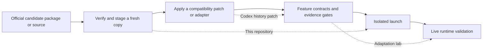

# electron-update-safety

Make desktop-mod updates easier to trust: identify the official candidate you actually received, work from a new copy every time, then prove that an isolated test leaves no background process behind.

The tool grew out of ChatGPT/Codex desktop-mod update work, but it also fits other Windows Electron applications. It is a safety guardrail, not an updater or patcher.

## What can I use it for?

- Check that a candidate application, backend descriptor, and explicit version references match a recorded manifest before changing anything.
- Stage every attempt from an unmodified source copy instead of layering changes on a previously failed attempt.
- Launch a candidate with separate user data, logs, and a run identifier, leaving the live application and real session data alone.
- Track the main process and a named backend after the window closes, including orphaned backends, PID reuse, and close timeouts.

It is for people maintaining custom desktop clients who need update evidence. It is not a one-click official downloader or automatic adaptation service.

## Which of the three repositories do I need?

| Problem | Repository |
|---|---|
| Is the candidate package correct, and did isolated testing leave a process behind? | **electron-update-safety** (this repository) |
| Does a Codex history request fail at a Responses-compatible provider? | [codex-history-compat](https://github.com/catterhu1207-ux/codex-history-compat) |
| How do I prevent a candidate from advancing without source-bound runtime proof? | [desktop-adaptation-lab](https://github.com/catterhu1207-ux/desktop-adaptation-lab) |



## Inputs, outputs, and safety limits

| You provide | The tool checks or creates |
|---|---|
| Candidate directory, manifest, and version-consumer directory | JSON results for file digests, backend descriptor, and explicit version references |
| A passing source directory and work directory | A fresh, traceable staged copy; failed attempts are never reused |
| Executable and run root | Separate user data, logs, `run.json`, and main/backend process identities |

`stop` only posts a normal close request to a visible test window created by this tool whose identity still matches. It never force-kills user processes and never downloads, installs, modifies, or authorizes vendor applications.

## Quick path

Python 3.10+ is required. Live process inspection is Windows-only.

```powershell
py -3 -m pip install -e .

# Replace the placeholder digest in examples/manifest.json first.
electron-update-safety check `
  --source C:\candidate `
  --manifest .\examples\manifest.json `
  --consumer-root C:\adapter

# Stage only after check passes; each call creates a new attempt directory.
electron-update-safety stage `
  --source C:\candidate `
  --manifest .\examples\manifest.json `
  --consumer-root C:\adapter `
  --work-root C:\staging
```

Commands emit UTF-8 JSON. A blocked check, orphaned backend, or close timeout returns a non-zero exit code. The `run_id` from `start` identifies `run-<run_id>` below `--runs-root`; use that directory with `status`, `wait`, and `stop`. See `electron-update-safety --help` and [examples/manifest.json](examples/manifest.json).

## What it does not do

- It does not decide whether a third-party installer is safe, authorized, or legitimate.
- It does not prove UI behavior is correct. Use [desktop-adaptation-lab](https://github.com/catterhu1207-ux/desktop-adaptation-lab) to record feature and renderer proof.
- It does not replace backups, code review, or vendor update notes.

This is an experimental source release. 中文说明见 [README.md](README.md).
