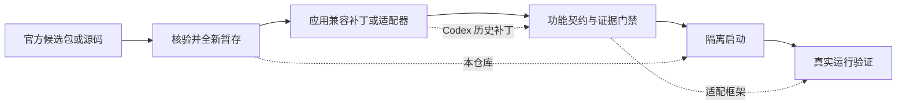

# electron-update-safety

我做这个工具，是因为自己的 ChatGPT/Codex 魔改版会随着官方桌面版更新而需要重新适配。新包的版本、结构和运行方式都可能变化。我不想在每天正在使用的版本上反复试错，也不想把一次能启动误写成已经适配成功。

所以我把更新前后的第一步单独做成了这个工具：先确认拿到的是哪一份候选包，再从全新的副本开始，最后用隔离运行确认窗口退出后没有留下后台进程。它来自 ChatGPT/Codex 桌面魔改版的维护实践，也可用于其他 Windows Electron 应用。

## 我可以拿它做什么？

- 更新自己的 ChatGPT/Codex 或其他 Electron 魔改版前，核对候选应用文件、后端描述和版本引用是否与登记一致。
- 每次从未经修改的官方副本重新暂存，避免在上一次失败的修改品上继续叠加补丁。
- 用独立的用户目录、日志和运行标识启动候选应用，不碰正在使用的正式版和真实会话。
- 观察主进程与指定后端；即使窗口已经关闭，也能发现仍存活的后台进程、PID 重用或关闭超时。

适合维护自定义桌面客户端、需要保留更新证据的人。不适合寻找“一键下载官方更新”或“一键自动适配”的使用者。

它为 [desktop-adaptation-lab](https://github.com/catterhu1207-ux/desktop-adaptation-lab) 中介绍的多线程工作流改造提供更新安全边界：新包先在隔离副本验证，不碰正式应用和真实会话。

## 三个仓库怎么选？

| 你要解决的问题 | 使用这个仓库 |
|---|---|
| 候选包是不是对的？隔离测试有没有遗留进程？ | **electron-update-safety**（本仓库） |
| Codex 向 Responses 兼容服务发送历史时被拒绝 | [codex-history-compat](https://github.com/catterhu1207-ux/codex-history-compat) |
| 如何把“发现新版”推进到“已经真实验证”而不跳过证据 | [desktop-adaptation-lab](https://github.com/catterhu1207-ux/desktop-adaptation-lab) |



## 输入、产出与安全边界

| 你提供 | 工具检查或生成 |
|---|---|
| 候选应用目录、清单、版本消费者目录 | 文件摘要、后端描述和显式版本引用的 JSON 检查结果 |
| 通过检查的来源目录与工作目录 | 一个新的、可追溯的暂存副本，不复用旧失败副本 |
| 可执行文件与隔离运行目录 | 独立用户数据、日志、`run.json` 和主进程/后端身份记录 |

`stop` 只会向本工具创建、身份仍一致的可见测试窗口发送正常关闭请求。它不会强行终止用户进程，也不会下载、安装、修改或授权任何厂商应用。

## 最短使用路径

需要 Python 3.10+；真实进程检查仅支持 Windows。

```powershell
py -3 -m pip install -e .

# 先把 examples/manifest.json 中的占位摘要改成候选文件的真实 SHA-256。
electron-update-safety check `
  --source C:\candidate `
  --manifest .\examples\manifest.json `
  --consumer-root C:\adapter

# 只有 check 通过后才暂存；每次都会生成新的 attempt 目录。
electron-update-safety stage `
  --source C:\candidate `
  --manifest .\examples\manifest.json `
  --consumer-root C:\adapter `
  --work-root C:\staging
```

所有命令输出 UTF-8 JSON；阻塞、后台残留或关闭超时会返回非零退出码。取得暂存目录后，可用 `start`、`status`、`wait` 和 `stop` 管理一次隔离运行；`start` 输出的 `run_id` 对应 `--runs-root` 下的 `run-<run_id>` 目录，再将该目录交给后续命令的 `--run` 参数。

清单格式见 [examples/manifest.json](examples/manifest.json)，命令参数见 `electron-update-safety --help`。

## 它不能替你做什么？

- 不判断第三方安装包是否安全、合法或获得授权。
- 不证明应用功能已经正确；它证明的是来源、暂存和进程生命周期。界面与功能证据应交给 [desktop-adaptation-lab](https://github.com/catterhu1207-ux/desktop-adaptation-lab) 管理。
- 不替代备份、代码审查或厂商更新说明。

这是实验性源码发布。英文说明见 [README.en.md](README.en.md)。
